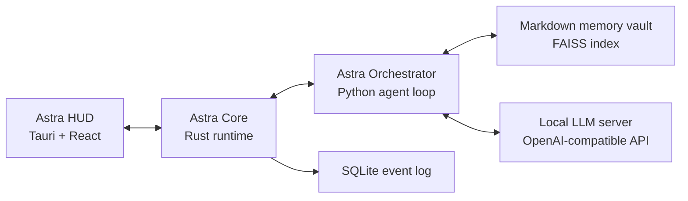

# Project Astra

> A local-first, tool-augmented AI assistant for Linux desktops.

Project Astra combines a deterministic Rust runtime, a Python reasoning layer,
and a Tauri/React desktop HUD into a personal assistant stack that can reason
over local context, retrieve memory, request tools, and report results through a
lightweight overlay.

The core design boundary is deliberate:

> The language model proposes actions. The runtime validates, records, and
> executes them through explicit events and tool contracts.


## Contents

- [What Astra Is](#what-astra-is)
- [Architecture](#architecture)
- [Repository Layout](#repository-layout)
- [Runtime Requirements](#runtime-requirements)
- [Setup](#setup)
- [Local LLM Backend](#local-llm-backend)
- [Testing](#testing)
- [Safety Model](#safety-model)
- [Development Guidelines](#development-guidelines)
- [Documentation](#documentation)

## What Astra Is

Astra is not a standalone chatbot. It is an event-driven assistant runtime that
treats model output as a proposal, not as authority. The system is designed for
local desktop automation, memory-assisted reasoning, and controlled tool use.

| Capability | Description |
| --- | --- |
| Local-first operation | Runs primarily on the user's machine with local memory and local IPC. |
| Tool-augmented reasoning | Exposes shell and memory actions through structured tool contracts. |
| Event-sourced runtime | Records important activity as events that can be reduced into state. |
| Memory retrieval | Reads markdown memory files, chunks them, embeds them, and retrieves relevant context. |
| Desktop HUD | Provides a compact Tauri/React interaction surface for repeated use. |

## Architecture

Astra is split into three primary layers.



| Layer | Path | Responsibility |
| --- | --- | --- |
| Astra Core | `core/` | IPC server, event bus, SQLite logging, reducer state, tool execution, Game Mode suspension hooks. |
| Astra Orchestrator | `orchestrator/` | Prompt construction, memory retrieval, LLM calls, tool-call extraction, agent loop. |
| Astra HUD | `hud/` | Desktop overlay, user input, assistant output, tool status display. |

### Event Flow

```text
User input
  -> HUD
  -> Rust core IPC event
  -> Python orchestrator prompt cycle
  -> model response
  -> optional tool request
  -> Rust tool runner
  -> tool result event
  -> orchestrator continuation
  -> HUD output
```

## Repository Layout

```text
.
├── core/          Rust runtime, IPC server, reducer, event log, and tools
├── hud/           Tauri and React desktop overlay
├── memories/      Local markdown memory vault placeholder
├── orchestrator/  Python agent loop, prompts, memory retrieval, and LLM client
├── tests/         Python unit tests and live E2E test harnesses
├── Astra.md       Expanded system design document
└── Project_Astra_Complete_Consolidated_Spec.docx.md
                  Consolidated technical specification
```

## Runtime Requirements

| Requirement | Purpose |
| --- | --- |
| Linux | Primary target environment. |
| Hyprland | Used by the current desktop workflow and Game Mode integration. |
| Rust and Cargo | Builds the core runtime and Tauri shell. |
| Python 3.11+ | Runs the orchestrator. |
| Node.js and npm | Builds and runs the HUD frontend. |
| Local LLM server | Provides an OpenAI-compatible completions endpoint. |

> Note: The current implementation is tuned for the local path layout in this
> repository. Some paths, including the memory vault path, are still hard-coded
> and should be moved into configuration as the project matures.

## Setup

Clone the repository and enter the project root:

```bash
git clone https://github.com/Nexusdeveloper902/Project-Astra.git
cd Project-Astra
```

### 1. Build the Core

```bash
cd core
cargo build
```

Run the core tests:

```bash
cargo test
```

### 2. Prepare the Orchestrator

```bash
cd ../orchestrator
python -m venv venv
source venv/bin/activate
pip install -e .
```

The orchestrator currently expects the memory vault at:

```text
/home/jperez/Astra/memories
```

### 3. Build the HUD

```bash
cd ../hud
npm install
npm run build
```

Run the Tauri development shell:

```bash
npm run tauri dev
```

## Local LLM Backend

Astra expects an OpenAI-compatible completions endpoint at:

```text
http://localhost:8080/v1/completions
```

Example `llama.cpp` command:

```bash
llama-server \
  -m /path/to/model.gguf \
  -ngl 99 \
  -c 4096 \
  --port 8080
```

Recommended model class:

| Role | Example |
| --- | --- |
| General reasoning | Qwen2.5 14B Instruct or similar local instruct model. |
| Faster responses | Smaller instruct model such as Qwen2.5 7B or 3B class. |
| Embeddings | Current code uses a deterministic dummy embedder for tests and early local development. |

## Testing

### Python Unit Tests

```bash
python -m unittest \
  tests.test_memory_components \
  tests.test_prompt_schema_client \
  tests.test_agent_cycle
```

### Rust Core Tests

```bash
cd core
cargo test
```

### Live E2E Tests

The E2E tests require a running Astra IPC socket and live agent runtime:

```bash
python -m unittest tests.test_search_resilience
```

| Suite | Scope | Requires live runtime |
| --- | --- | --- |
| `tests.test_memory_components` | Parser, embedder, memory index behavior. | No |
| `tests.test_prompt_schema_client` | Prompt construction, tool schemas, LLM HTTP client. | No |
| `tests.test_agent_cycle` | Agent-cycle routing with mocked socket/model/index. | No |
| `tests.test_search_resilience` | End-to-end behavior over `/tmp/astra.sock`. | Yes |
| `cargo test` | Core reducer, IPC, security, database, and tool runner tests. | No |

## Safety Model

Astra treats the LLM as an untrusted planner. Tool execution is routed through
the core runtime and represented as explicit events. System-modifying actions
are expected to require user confirmation and post-action verification before
the assistant reports success.

### Safety Rules

- Do not execute destructive actions without explicit approval.
- Verify modifying actions with a follow-up observation.
- Do not search hidden files or directories unless the user asks for them.
- Keep local data local by default.
- Prefer structured tool contracts over free-form execution.
- Keep generated files, dependency folders, bytecode, and build outputs out of
  version control.

### Trust Boundary

| Component | Trust Level | Notes |
| --- | --- | --- |
| LLM output | Untrusted | May propose actions but cannot authorize execution. |
| Rust core | Trusted runtime | Owns event ordering, execution boundaries, and state reduction. |
| Tool runner | Controlled executor | Runs approved tools and returns structured results. |
| Memory vault | Local data source | Human-readable markdown, indexed for retrieval. |

## Development Guidelines

- Keep the core deterministic. State changes should flow through events and the
  reducer.
- Keep the orchestrator testable without a live model by mocking HTTP, socket,
  memory, and index boundaries.
- Keep documentation close to behavior. If a workflow changes, update the
  README or relevant design document in the same change.
- Avoid committing generated artifacts such as `__pycache__`, virtual
  environments, `node_modules`, and build output.

## Documentation

| Document | Purpose |
| --- | --- |
| [Astra.md](Astra.md) | Expanded system design and architectural notes. |
| [Project_Astra_Complete_Consolidated_Spec.docx.md](Project_Astra_Complete_Consolidated_Spec.docx.md) | Consolidated technical specification. |
| [hud/README.md](hud/README.md) | HUD package setup and responsibilities. |
| [memories/README.md](memories/README.md) | Memory vault usage notes. |

## Current Status

Project Astra is an active prototype. The repository contains working core
building blocks, an orchestrator loop, a HUD package, safety-oriented prompt
rules, Game Mode integration work, and a growing test suite. Some production
concerns, such as fully configurable paths, hardened tool sandboxing, migration
management, and packaged startup orchestration, remain future work.
